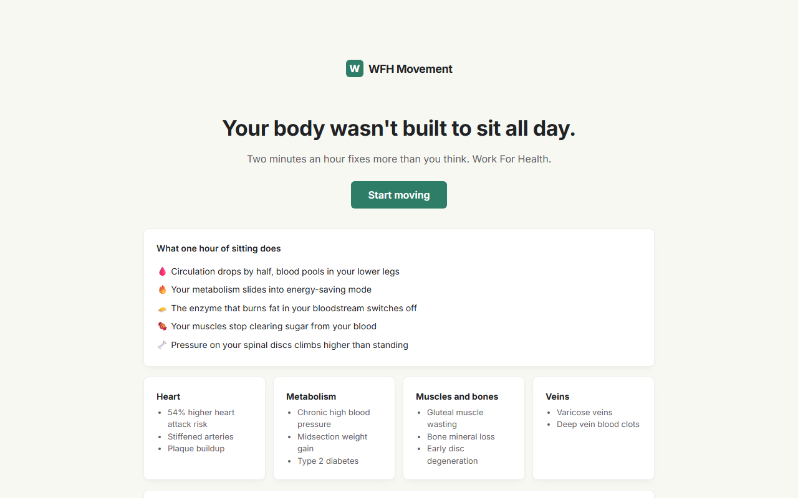

# WFH Movement

Your body wasn't built to sit all day. WFH Movement is a progressive web app that turns two-minute movement breaks into a habit you actually keep: reminders on your schedule, a real exercise library, and just enough game to make you want the streak.

**Live app:** https://wfh-movement.netlify.app



## The part worth bragging about

The app sends movement reminders to an Apple Watch. No Swift, no Xcode, no Mac, no $99 developer account. A home-screen PWA on iOS can receive web push, and the watch mirrors it to your wrist. A Netlify scheduled function checks every minute who is due in their own timezone and pushes a real exercise from the library. Built and confirmed on a real wrist from a Windows machine.

The insight that made it work: iOS kills a service worker's local timers the moment the app closes, so client-side reminders can never be trusted. Server-sent push wakes the worker regardless. The "reminders don't fire" problem and the "get it on my watch" problem were the same problem.

## What's inside

- **Reminders** on your work schedule: every X minutes or fixed times, with quiet respect for your workday boundaries
- **Exercise library** of desk-friendly movements, rotated so consecutive breaks differ
- **Stiffness scan** with severity levels and coaching that adapts what it recommends
- **Gamification core loop**: XP, streaks, a daily goal, a quest board, and an avatar picker
- **Antigravity**, a built-in mini game
- **Hydration tracker and movement lifelog**
- **Theme switcher**
- **Wrist reminders** via web push, with per-timezone scheduling and dedup

## Privacy by design

Everything lives in localStorage on your device: XP, history, stiffness, hydration, all of it. The only thing the server ever stores is a push subscription and the reminder schedule, and only if you turn wrist reminders on. Your data never leaves your device.

## Stack

Vanilla JavaScript, HTML, and CSS. No framework, no build step. A service worker for offline and push. Netlify hosts the static files; two serverless functions (`netlify/functions/`) handle push subscriptions (Netlify Blobs) and the every-minute reminder cron (`web-push`).

Pure-function modules (`push-schedule.js`, `quests.js`, `rotation.js`, and friends) keep the logic testable:

```
npm test        # runs all 16 test files in tests/
```

## Docs

Every feature shipped from a written design spec. They live in [docs/superpowers/specs/](docs/superpowers/specs/), from the first design through the push backend.
